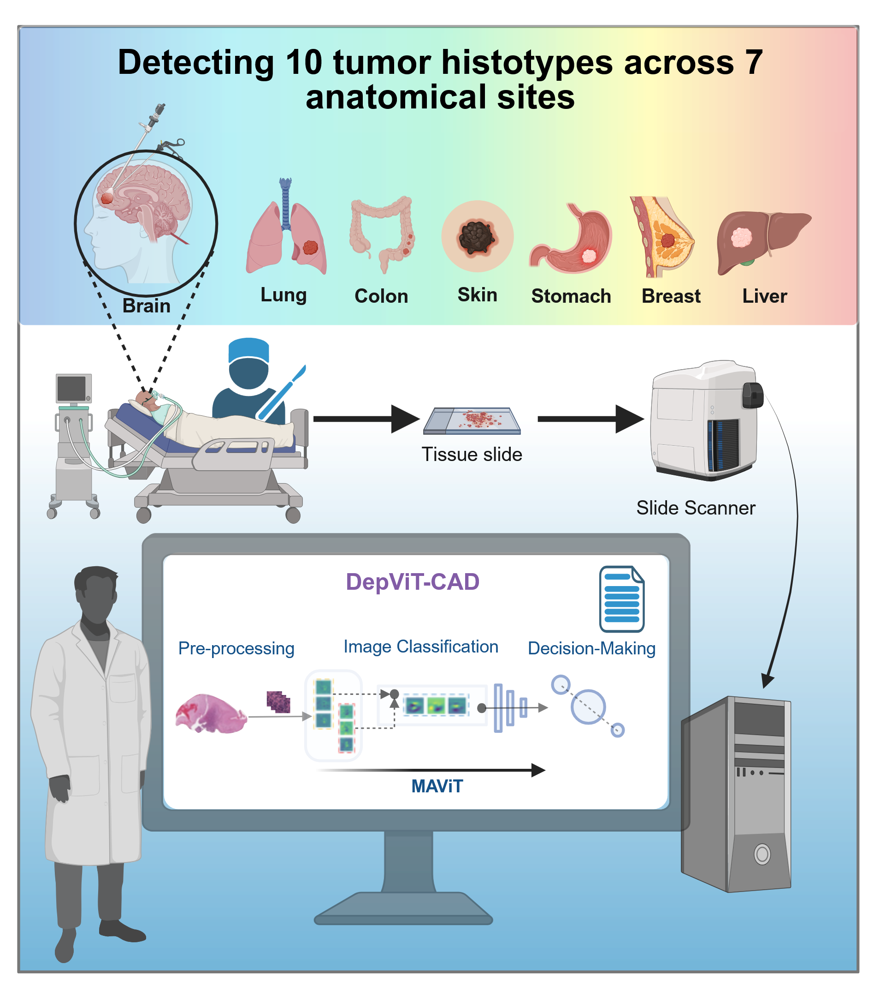

# DepViT-CAD

This repository includes MAViT, introduced in our paper titled: "DepViT-CAD: Deployable Vision Transformer-Based Cancer Diagnosis in Histopathology".
Paper link: https://arxiv.org/abs/2507.10250

Please cite our work (paper) if you use any part of the code, paper, or associated concepts at any stage.

The dataset used is also made available here.

